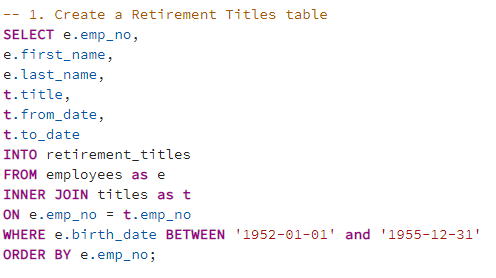
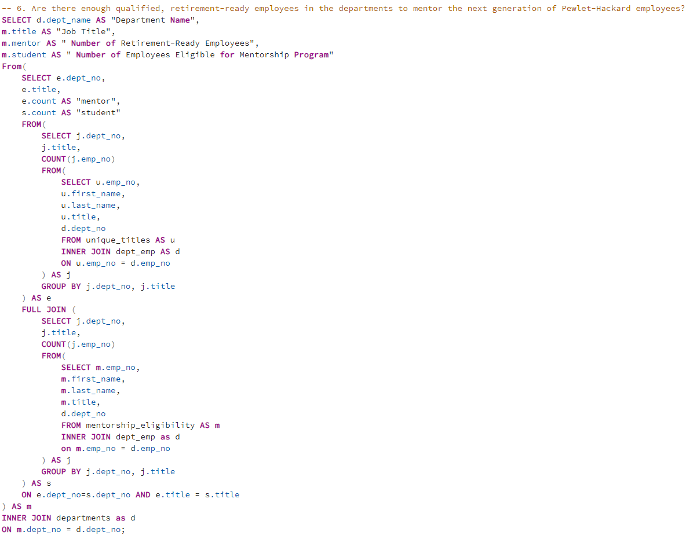

# Pewlett-Hackard-Analysis

## **Overview of Pewlett-Hackard Analysis**

### Determine the number of retiring employees per title and identify employees who are eligible to participate in a mentorship program.

## **Results**

- **Created a Retirement Titles table that holds all the titles of employees who were born  1952-01-01 and 1955-12-31.**

  <table>
  <tr>
    <td>Retirement Titles Table Query</td>
    <td>Retirement Titles Table</td>
  </tr>
  <tr>
    <td></td>
    <td></td>
  </tr>
  </table>
  
- **Filtered data and removed duplicated rows by using DISTINCT ON paired with ORDER BY to only retain the latest title for each retirement-age employees.**
  
  <table>
  <tr>
    <td>Unique Title Table Query</td>
    <td>Unique Title Table</td>
  </tr>
  <tr>
    <td></td>
    <td></td>
  </tr>
   </table>
  
- **Created a Retiring Title table to display the total number of employees retiring from each job title.**
  
  <table>
  <tr>
    <td>Retiring Title Table Query</td>
    <td>Retiring Title Table</td>
  </tr>
  <tr>
    <td></td>
    <td></td>
  </tr>
  </table>
  
- **Created a Mentorship Eligibility table that holds the employees who are eligible to participate in a mentorship program. The candidates must be current emplopyees who were born in 1965.**
  
  <table>
  <tr>
    <td>Mentorship Eligibility Table Query</td>
    <td>Mentorship Eligibility Table</td>
  </tr>
  <tr>
    <td></td>
    <td></td>
  </tr>
  </table>

## **Summary**

- **How many roles will need to be filled as the "silver tsunami" begins to make impact?**

  - _There will be 72,458 roles that need to be filled as the "silver tsunami" begins to make impact._
  
  <table>
  <tr>
    <td>Total of Retiring Employees Query</td>
    <td>Total of Retiring Employees</td>
  </tr>
  <tr>
    <td></td>
    <td></td>
  </tr>
  </table>

- **Are there enough qualified, retirement-ready employees in the departments to mentor the next generation of Pewlet-Hackard employees?**

  - _We retieved the number of employees who are qualified for the mentorship program with different job titles in each department and compared them with the number of qualified , retirement-ready employees with the same job title in each department. As shown in the table below, there are enough retirement-ready employees in each department to mentor the next generation of Pewlet-Hackard employees._
  
  <table>
  <tr>
    <td>Sufficient Employees for Mentorship Program Query</td>
    <td>Sufficient Employees for Mentorship Program</td>
  </tr>
  <tr>
    <td></td>
    <td></td>
  </tr>
  </table>
